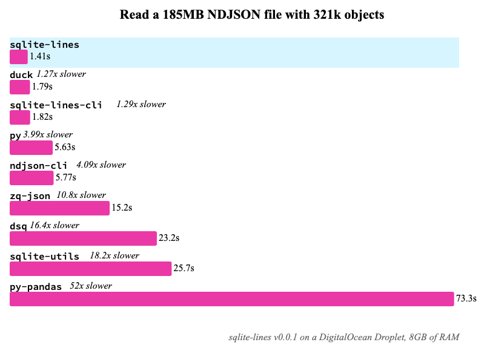

# sqlite-lines

`sqlite-lines` is a SQLite extension for reading lines from a file or blob.



<small>See [Benchmarks](./benchmarks) for more info.</small>

## Usage

```sql
.load ./lines0
select line from lines_read('logs.txt');
```

`sqlite-lines` is great for line-oriented datasets, like [ndjson](https://ndjson.org/) or [JSON Lines](https://jsonlines.org/), when paired with SQLite's [JSON support](https://www.sqlite.org/json1.html). Here, we calculate the top 5 country participants in Google's [Quick, Draw!](https://quickdraw.withgoogle.com/data) dataset for [`calendars.ndjson`](https://storage.googleapis.com/quickdraw_dataset/full/simplified/calendar.ndjson):

```sql
select
  line ->> '$.countrycode' as countrycode,
  count(*)
from lines_read('./calendar.ndjson')
group by 1
order by 2 desc
limit 5;
/*
┌─────────────┬──────────┐
│ countrycode │ count(*) │
├─────────────┼──────────┤
│ US          │ 141001   │
│ GB          │ 22560    │
│ CA          │ 11759    │
│ RU          │ 9250     │
│ DE          │ 8748     │
└─────────────┴──────────┘
*/
```

Use the SQLite CLI's [`fsdir()`](https://sqlite.org/cli.html#file_i_o_functions) table functions with `lines_read()` to read lines from every file in a directory.

```sql
select
  name as file,
  lines.rowid as line_number,
  line
from fsdir('logs')
join lines_read(name) as lines
where name like '%.txt';
/*
┌─────────────────────┬──────┐
│ file  │ line_number | line │
├───────┼─────────────┤──────┤
| a.txt | 1           | x    |
| a.txt | 2           | y    |
| a.txt | 3           | z    |
| b.txt | 1           | xx   |
| b.txt | 2           | yy   |
| c.txt | 1           | xxx  |
└───────┴─────────────┴──────┘
*/
```

## Documentation

See [`docs.md`](./docs.md) for a full API Reference and detailed documentation.

## Installing

| Language       | Install                                                    |                                                                                                                                                                                           |
| -------------- | ---------------------------------------------------------- | ----------------------------------------------------------------------------------------------------------------------------------------------------------------------------------------- |
| Python         | `pip install sqlite-lines`                                   | [](https://pypi.org/project/sqlite-lines/)                                                      |
| Datasette      | `datasette install datasette-sqlite-lines`                   | [](https://datasette.io/plugins/datasette-sqlite-lines) |
| Node.js        | `npm install sqlite-lines`                                   | [](https://www.npmjs.com/package/sqlite-lines)                                                |
| Deno           | [`deno.land/x/sqlite_lines`](https://deno.land/x/sqlite_lines) | [](https://deno.land/x/sqlite_lines)        |
| Ruby           | `gem install sqlite-lines`                                   |                                                                                                    |
| Github Release |                                                            |                      |

<!--
| Elixir         | [`hex.pm/packages/sqlite_lines`](https://hex.pm/packages/sqlite_lines) | [](https://hex.pm/packages/sqlite_lines)                                                                       |
| Go             | `go get -u github.com/asg017/sqlite-lines/bindings/go`               | [](https://pkg.go.dev/github.com/asg017/sqlite-lines/bindings/go)                                     |
| Rust           | `cargo add sqlite-lines`                                             | [](https://crates.io/crates/sqlite-lines)                                                                                 |
-->

The [Releases page](https://github.com/asg017/sqlite-lines/releases) contains pre-built binaries for Linux amd64 and MacOS (amd64, no arm).

### As a loadable extension

If you want to use `sqlite-lines` as a [Runtime-loadable extension](https://www.sqlite.org/loadext.html), Download the `lines0.dylib` (for MacOS) or `lines0.so` file from a release and load it into your SQLite environment.

> **Note:**
> The `0` in the filename (`lines0.dylib` or `lines0.so`) denotes the major version of `sqlite-lines`. Currently `sqlite-lines` is pre v1, so expect breaking changes in future versions.

For example, if you are using the [SQLite CLI](https://www.sqlite.org/cli.html), you can load the library like so:

```sql
.load ./lines0
select lines_version();
-- v0.0.1
```

Or in Python, using the builtin [sqlite3 module](https://docs.python.org/3/library/sqlite3.html):

```python
import sqlite3

con = sqlite3.connect(":memory:")

con.enable_load_extension(True)
con.load_extension("./lines0")

print(con.execute("select lines_version()").fetchone())
# ('v0.0.1',)
```

Or in Node.js using [better-sqlite3](https://github.com/WiseLibs/better-sqlite3):

```javascript
const Database = require("better-sqlite3");
const db = new Database(":memory:");

db.loadExtension("./lines0");

console.log(db.prepare("select lines_version()").get());
// { 'lines_version()': 'v0.0.1' }
```

Or with [Datasette](https://datasette.io/) (using the "no filesystem" version to limit security vulnerabilities):

```
datasette data.db --load-extension ./lines_nofs0
```

Windows is not supported - [yet](https://github.com/asg017/sqlite-lines/issues/4)!

### From the browser with WASM/JavaScript

`sqlite-lines` is also distributed as a standalone [SQL.js](https://github.com/sql-js/sql.js) library. It's essentially a fork of the original SQL.js library, with the addition of `sqlite-lines` functions like `lines_version()` and `lines()`.

Check out [this Observable notebook](https://observablehq.com/@asg017/introducing-sqlite-lines) for the full demonstration. The [Releases page](https://github.com/asg017/sqlite-lines/releases) contains the JavaScript and WASM files.

### The sqlite-lines CLI

`sqlite-lines` comes with an example CLI modeled after [ndjson-cli](https://github.com/mbostock/ndjson-cli) that demos the speed and versatility of `sqlite-lines`. Download a pre-compiled version from the [Releases page](https://github.com/asg017/sqlite-lines/releases), or build yourself with:

```
make cli
./dist/sqlite-lines
```

The `sqlite-lines` CLI reads data from stdin and applies transformations with SQL code through its arguments.

The first argument should be a SQL expression that is used transform a single line from stdlin. The available columns are `rowid`, which is the "line number" that is being processed, and `d`, an alias for `line`, which is the text content of the current line (inspired by ndjson-cli). For example, to uppercase every line from a file with [`upper()`](https://www.sqlite.org/lang_corefunc.html#upper):

```bash
$ cat names.txt | sqlite-lines 'rowid || upper(d)'
1ALEX
2BRIAN
3CRAIG
```

This includes SQLite's new JSON `->` and `->>` operators for NDJSON/JSONL files:

```bash
$ cat data.ndjson | sqlite-lines 'd ->> "$.id"'
$ cat data.ndjson | sqlite-lines 'json_object("name", d ->> "$.name", "age": d ->> "$.stats.age")'
```

The second argument is another SQL expression that's used in the WHERE statement of the underlying SQL query to filter out lines.

```bash
# get the names of all people older than 40
cat data.ndjson | sqlite-lines 'd ->> "$.name"' 'd ->> "$.age" > 40'
```

The third argument is another SQL expression that's used in the GROUP BY statement of the underlying SQL query to aggregate lines.

### A Note on CSV Parsing

`sqlite-lines` isn't a great option for CSVs. Technically you can, but the moment your data has a `\n` character in a field or header, then you'll get corrupted results.

Instead, you should use the "official" [CSV Virtual Table](https://www.sqlite.org/csv.html), or use the [`.import`](https://www.sqlite.org/cli.html#csv) command in the SQLite CLI.
