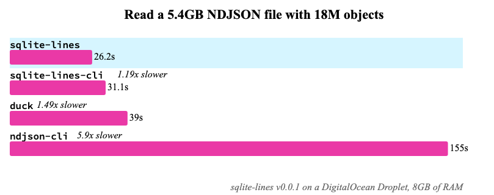
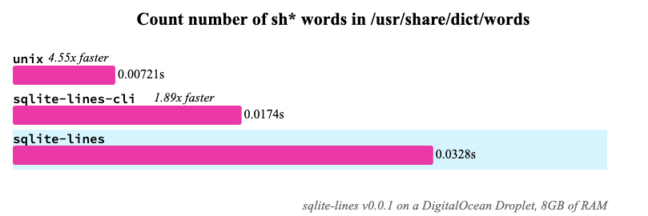
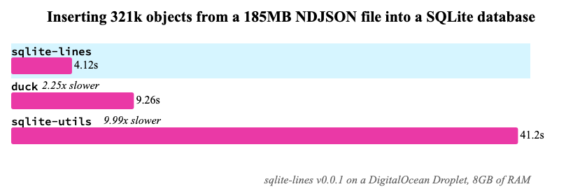

# Benchmarks

Uses [hyperfine](https://github.com/sharkdp/hyperfine) for somewhat stable benchmarks.

Benchmarks results shown here were ran on an Ubuntu DigitalOcean droplet with 8GB of RAM.

The following version of the various tools benchmarks are here (ran with [`./versions.sh`](./versions.sh)):

```bash
+ ndjson-map --version
0.3.1
+ python3 --version
Python 3.8.10
+ duckdb --version
v0.4.0 da9ee490d
+ dsq --version
dsq 0.17.0
+ sqlite3 :memory: '.load ../dist/lines0' 'select lines_version()'
v0.0.1
+ python3 -c 'import pandas as pd; print(pd.__version__)'
1.4.2
+ zq --version
Version: v1.0.0
```

## CAVEAT: BENCHMARKS ARE HARD

These aren't 100% conclusive "sqlite-lines is the fastest" benchmarks. Instead, these are some real-life cases where I found a need for a line-oriented or NDJSON parser, and I reached for the most familar and easiest CLI-based tools to make a comparison.

If you think these are incomplete, or I'm mis-using one of these tools, or there's another tools that isn't included, file an issue.

## Benchmarks

### Parse and calculate on a 180MB NDJSON File

**Goal:** Go through a large NDJSON file with 300k individual objects, and calculate the sum of the number of elements in a single property.


**Commentary:** The [`py.sh`](./calc/py.sh) script is a good baseline for a problem like this: Use Python's `for line in file`, parse as JSON, and keep a running total, quick and easy, takes about 5 seconds. [`ndjson-cli`](https://github.com/mbostock/ndjson-cli) adds another straightforward baseline, based in Node.js. "Helper" data processing CLI tools like [`dsq`](https://github.com/multiprocessio/dsq), [`sqlite-utils`](https://sqlite-utils.datasette.io/en/stable/), and [`zq`](https://www.brimdata.io/blog/introducing-zq/) sacrifice speed in exchange for simplicity. Pandas just completely chokes on large NDJSON files.

`sqlite-lines` and `duckdb`, however, perform extremely well with this. [DuckDB](https://duckdb.org/)'s new [`read_json_object`](https://github.com/duckdb/duckdb/pull/3435) performs extremely well with large datasets. `sqlite-lines`, on the other hand, is essentially a light wrapper around [`getdelim()`](https://pubs.opengroup.org/onlinepubs/9699919799/functions/getdelim.html), and [SQLite's JSON support](https://www.sqlite.org/json1.html) claims processing speed of "over 1 GB/s", making `sqlite-lines` one of the fastest and most complete NDJSON tools.

### "Large" 5GB+ NDJSON Parsing

**Goal:** See if `sqlite-lines` and other tools can handle extremely large NDJSON datasets, in this case a dataset of [detected buildings in Brazil](https://github.com/microsoft/SouthAmericaBuildingFootprints).



**Commentary:** `sqlite-lines` holds its weight with larger datasets. Since `lines_read()` doesn't read the entire file into memory, it gets around the [maximum 1GB blob SQLite limit](https://www.sqlite.org/limits.html), allowing you to work on larger datasets. Other tools were left out of this benchmark since they simply took too long (and might fail after running out of memory).

### Count all `sh*` words in `/usr/share/dict/words`

**Goal:** Compare speeds of `sqlite-lines` + SQLite's `LIKE` operator compared to good ol' fashion `cat | grep`.



**Commentary:** `cat | grep` is clearly faster here, but I get varying results compared to locally on a Macbook and on a true Linux machine. I'd imagine the startup time for SQLite and the `LIKE` operator is what's slowing things down.

### Insert NDJSON objects into a SQLite table

**Goal:** From a NDJSON source, import the data into a flat SQLite table.



**Commentary:** Since the other tests involved only reading in data, this tests shows that `sqlite-lines` can also be used to transform NDJSON/line-oriented data and insert into a SQLite database.

`sqlite-utils` is quite slow for a number of reasons (written in Python, running multiple SQL commands instead of one, switching between Python <-> SQLite), but you may prefer the simple CLI over plain SQL.

DuckDB can also write the results of `json_read_objects` to a DuckDB table, but it's a completely different file format than SQLite's and isn't comparable. DuckDB will [automatically create indicies](https://duckdb.org/docs/sql/indexes) for all columns in a table, making future analytical queries much faster. In SQLite you'd have to [manually create them](https://www.sqlite.org/lang_createindex.html), and that amount of time would probably be equivalent to the extra time DuckDB takes<sup>[citation needed]</sup>.
